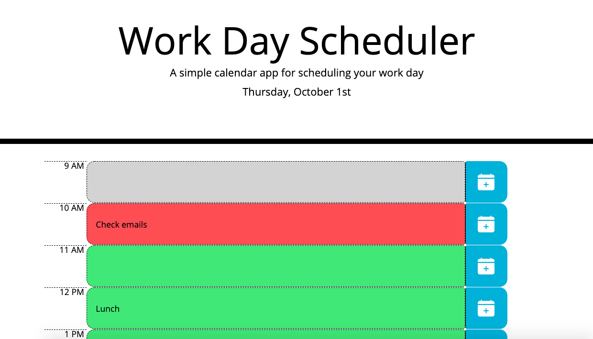

# Workday Schedule

## Description

A simple web calendar application that allows the user to save events for each hour of the day during business hours.

## Technologies

* HTML
* CSS
* JavaScript
* jQuery
* BootStrap
* Moment.js

## Goal of the Project

#### Create a simple calendar that allows the user to save events for each hour of the day

In order to ensure the web application is responsive, I used Bootstrap's components and grid layout so that the contents are intact in a variety of screen sizes. To do this, I needed to use relational ratio for positions and widths and heights. 

As a calendar, I used Moment.js to keep track of the current time and to illustrate whether a timeblock was in the past, present, or future. The user will be able to enter text in the timeblock and click the 'Add to Calendar' button to save the text.

## Usage
The following image is an example of the web application's appearance and functionality: 



## What I Did

#### Interactive Buttons

Use of buttons that allow the user to save input

```
$('.saveBtn').on('click', function(event){})
```

#### Today's Date

Current date showing in the header

```
$('#currentDay').text(moment().format('dddd, MMMM Do'))
```

#### Responsive Time Blocks

Use of Moment.js to change the colour of the time block to notify the user of the current hour

```
function colourCalendar(){
    var timeBlock = document.querySelectorAll('.time-block')
    var currentTime = moment().format('k')
    
    for(let i=0; i<timeBlock.length;i++){
        if (timeBlock[i].id == currentTime){
        if (timeBlock[i].classList.contains('past') || timeBlock[i].classList.contains('future')){
            timeBlock[i].classList.remove('past')
            timeBlock[i].classList.remove('future')
        }

        timeBlock[i].classList.add('present')
        } 
    }
}
```

#### Stores Inputs

User inputs in store to the browser's local storage

```
 let toDo = []

if (event.target.matches('button')) {
    toDo.push([currentHour, calendarInput])
    localStorage.setItem(toDo, JSON.stringify(toDo))
} 
```

## URL

See the web application [here](https://scaredofseagles.github.io/05-Homework/)

## License

MIT License

Copyright (c) 2020 Dailey Kaze

Permission is hereby granted, free of charge, to any person obtaining a copy of this software and associated documentation files (the "Software"), to deal in the Software without restriction, including without limitation the rights to use, copy, modify, merge, publish, distribute, sublicense, and/or sell copies of the Software, and to permit persons to whom the Software is furnished to do so, subject to the following conditions:

The above copyright notice and this permission notice shall be included in all copies or substantial portions of the Software.

THE SOFTWARE IS PROVIDED "AS IS", WITHOUT WARRANTY OF ANY KIND, EXPRESS OR IMPLIED, INCLUDING BUT NOT LIMITED TO THE WARRANTIES OF MERCHANTABILITY, FITNESS FOR A PARTICULAR PURPOSE AND NONINFRINGEMENT. IN NO EVENT SHALL THE AUTHORS OR COPYRIGHT HOLDERS BE LIABLE FOR ANY CLAIM, DAMAGES OR OTHER LIABILITY, WHETHER IN AN ACTION OF CONTRACT, TORT OR OTHERWISE, ARISING FROM, OUT OF OR IN CONNECTION WITH THE SOFTWARE OR THE USE OR OTHER DEALINGS IN THE SOFTWARE.